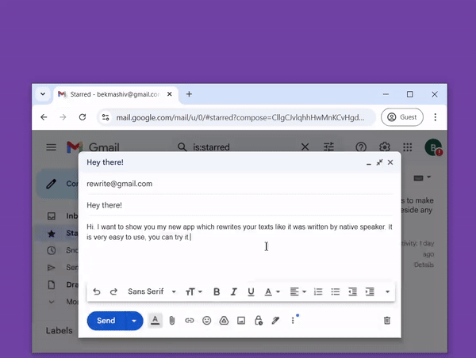

# Rewrite 📝✨

Tired of bouncing between your work and online grammar checkers? Rewrite will help ya. It's like having a writing assistant right on your desktop, ready to polish your text with just a hotkey. 

I have been using it for my personal needs. Before large language models, I utilized AI translators with multiple round trips, as I found they did a decent job of rewriting text. With the capabilities of large language models, the process can be taken even further. My main point is we all have LLM subscriptions and I stongly believe we should utilize them as much as we can.



## What it does 🚀

- **Instant text improvement** 🏃‍♂️💨: Highlight, hotkey, done. Your text is better.
- **Works everywhere** 🌍: As long as you are dealing with text, you're good to go.
- **No copy-pasting needed** 🙅‍♂️: Rewriter grabs your selected text and puts the improved version right back where you want it.

## How to use it 🔧

1. Install it (instructions below). Windows only for now 📥
2. Select any text ✍️
3. Hit `Ctrl+H` 🔥
4. Review the suggestions in the popup 🧐
5. Hit `Shift+Enter` to apply changes ✅

## Getting Started 🚦

1. Clone and install:
   ```
   git clone https://github.com/yourusername/rewriter.git
   cd rewriter
   pip install -r requirements.txt
   ```

2. Run it:
   ```
   python main.py
   ```

3. Set your API key in the settings (access via system tray icon) 🔑

## Customization 🎨

- Change hotkeys ⌨️
- Adjust other settings ⚙️

via the system tray icon 🖥️

## Tech Stuff (for the curious) 🤓

Built with Python 🐍, customtkinter 🖌️, and mainly LLM 🧠.

## Contribute 🤝

Got ideas? Issues? Pull requests welcome! 🙌

---

Made by [@mashabek](https://github.com/mashabek) to save you some keystrokes and headaches. 😎👍
